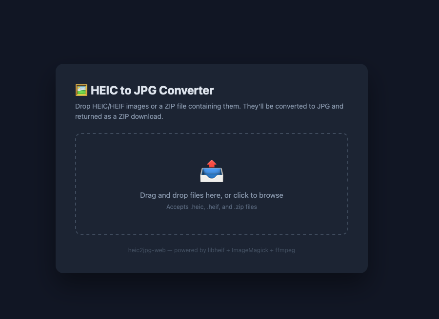

# heic2jpg-web

There are dozens of online HEIC converters. All of them require uploading your company's photos to someone else's server. This one runs on your network, behind your firewall, and takes 60 seconds to deploy.




Built with Cursor.

Author: Enrique Berrios

## The Problem

iPhones shoot HEIC by default. Windows can't open them without a codec from the Microsoft Store ($0.99/device, needs Microsoft accounts, doesn't deploy well via GPO/Intune). When you've got 200+ machines across multiple offices, that's not a real solution.

And those free online converters? Great — until your users are uploading client photos, legal documents, medical images, or anything covered by an NDA. "We sent your files to a random website" is not a sentence you want in an incident report.

## The Solution

A self-service web page on any Linux box you already have. Users drag-and-drop their HEIC files (or a ZIP), get back a ZIP of JPGs. No installs on their machines. No tickets. No data leaves your network. Takes 60 seconds to deploy.

## Prerequisites

Install a web server and PHP yourself (this repo does **not** install Apache or PHP). On Ubuntu/Debian:

```bash
sudo apt update
sudo apt install apache2 php libapache2-mod-php php-zip
```

You need **Apache + PHP with the Zip extension** so the browser can POST uploads to `heic_convert.php` and the server can read ZIP archives. Any equivalent stack (e.g. nginx + `php-fpm`) can work if you point it at the same files and PHP settings — the included `install.sh` assumes Apache and deploys under `/var/www/html/heic2jpg/`.

### Try it locally (macOS, quick test)

Production use is still **Linux + Apache** (or your own server). On a Mac you can smoke-test with PHP’s built-in server if PHP has the `zip` extension and converter CLIs are installed (e.g. `brew install libheif imagemagick`; `ffmpeg` is optional).

```bash
cd heic2jpg-web
php -S localhost:8080
```

Open <http://localhost:8080/> in your browser. The backend looks up `heif-convert`, `ffmpeg`, and `magick`/`convert` in `/usr/bin`, Homebrew (`/opt/homebrew/bin`), and your `PATH`.

## Quick Start

```bash
git clone https://github.com/eberrios73/heic2jpg-web.git
cd heic2jpg-web
sudo bash install.sh
```

The installer (after prerequisites are met):

1. Installs ImageMagick, libheif, and ffmpeg (converter toolchain)
2. Upgrades libheif to 1.18+ when needed (fixes iPhone HEIC compatibility)
3. Fixes ImageMagick's security policy to allow HEIC
4. Configures PHP upload limits (500MB) in `php.ini`
5. Deploys the web files to `/var/www/html/heic2jpg/`
6. Restarts Apache

Your converter will be live at `http://YOUR_SERVER_IP/heic2jpg/`

## Features

- Drag-and-drop or click to upload
- Accepts individual `.heic`/`.heif` files or `.zip` archives
- Terminal-style live progress log
- Automatically skips macOS `._` resource forks and `__MACOSX` directories
- Falls back through 3 converters: heif-convert → ffmpeg → ImageMagick
- Returns all converted JPGs in a single ZIP download
- No client-side installs required

## What you install vs. what `install.sh` installs

**You install (prerequisites):**

| Package | Purpose |
|---------|---------|
| `apache2` | Web server (serves the app) |
| `php` + `libapache2-mod-php` | Runs `heic_convert.php` / `heic_download.php` |
| `php-zip` | ZIP upload handling in PHP |

**`install.sh` installs (via apt):**

| Package | Purpose |
|---------|---------|
| `libheif-examples` | Primary converter (`heif-convert`) |
| `imagemagick` | Fallback converter (`convert`) |
| `ffmpeg` | Second fallback converter |

## Gotchas the Installer Handles For You

### libheif version

Ubuntu 22.04/24.04 ship libheif 1.17.x which fails on modern iPhone photos with HDR gain maps:

```
Invalid input: Too many auxiliary image references
```

The installer automatically upgrades to 1.18+ from the [strukturag PPA](https://launchpad.net/~strukturag/+archive/ubuntu/libheif).

### ImageMagick security policy

ImageMagick blocks HEIC by default. The policy at `/etc/ImageMagick-6/policy.xml` only allows `{GIF,JPEG,PNG,WEBP}`. The installer adds `HEIC,HEIF` to the allow list.

### macOS ZIP metadata

When Mac users create ZIP files, they include `._` resource fork files and a `__MACOSX/` directory. These aren't real images and will cause conversion errors. The converter automatically filters them out.

## Manual Install

If you prefer to do it yourself:

```bash
# Prerequisites: web server + PHP (install.sh does not install these)
sudo apt install apache2 php libapache2-mod-php php-zip

# Converter packages (or run install.sh instead of the next few package steps)
sudo apt install imagemagick libheif-examples ffmpeg

# Upgrade libheif
sudo add-apt-repository ppa:strukturag/libheif
sudo apt update
sudo apt install --only-upgrade libheif1 libheif-examples

# Fix ImageMagick policy
sudo sed -i 's/pattern="{GIF,JPEG,PNG,WEBP}"/pattern="{GIF,JPEG,PNG,WEBP,HEIC,HEIF}"/' /etc/ImageMagick-6/policy.xml

# Increase PHP upload limits (edit the apache2 php.ini)
# upload_max_filesize = 500M
# post_max_size = 500M
# max_execution_time = 300

# Deploy
sudo mkdir -p /var/www/html/heic2jpg
sudo cp index.html heic_convert.php heic_download.php /var/www/html/heic2jpg/
sudo chown -R www-data:www-data /var/www/html/heic2jpg
sudo systemctl restart apache2
```

## File Structure

```
heic2jpg-web/
├── docs/
│   └── ui-screenshot.png
├── install.sh          # One-command installer
├── index.html          # Standalone frontend (no frameworks, no dependencies)
├── heic_convert.php    # Backend: handles upload, conversion, streams progress
├── heic_download.php   # Backend: serves the converted ZIP
├── LICENSE             # MIT
└── README.md
```

## Requirements

- Ubuntu 20.04, 22.04, or 24.04 (Debian should also work)
- Root access to run `install.sh` and configure the system
- **Apache** and **PHP** with **`php-zip`** and **`libapache2-mod-php`** (install before `install.sh`; see [Prerequisites](#prerequisites))
- ~200MB disk space for packages
- `libheif-examples`, `ffmpeg`, and ImageMagick (installed by `install.sh`, or install manually)

## License

MIT
